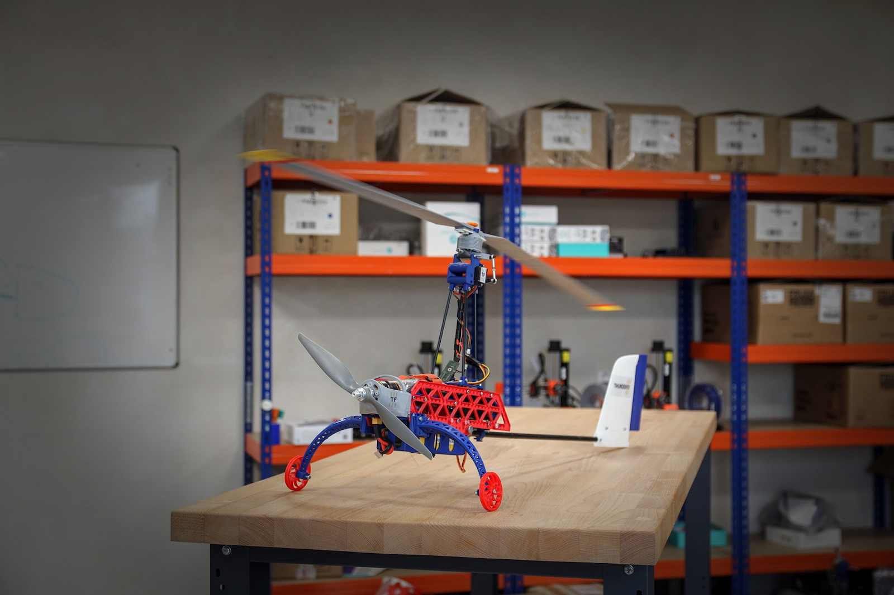
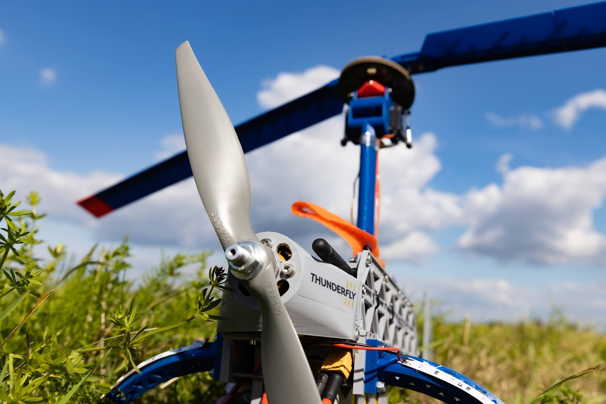

# TF-G2 unmanned training autogyro

[TF-G2](https://www.thunderfly.cz/tf-g2.html) autogyro is well-suited for training of pilots and for gaining experience with mission planning. TF-G2 is limited to light payloads and nice weather, but it shares all the specific properties of larger autogyros in our offering. It may find application in less demanding flight operations, however its main purpose is being a tool for low-cost pilot practice. The autogyro’s small size leads to easy transport, repairs and maintenance.
To enhance the ease of learnig of autogyro technology, we made possible to [simulate TF-G2 flight](https://github.com/ThunderFly-aerospace/PX4-FlightGear-Bridge) prior the real flight training.

This repository contains open-source design files of the autogyro construction. The most components are 3D-printed. However the printable data (gcodes) are generated by our special software suite - processor3D. It is required that parts are sliced properly according to material to make sure that resulted 3D printed parts could be used safely for the flight. **Therefore for safety reasons we do not recommend to attempt to slice the parts yourself. It is better to contact us.**

The product, support or accesories could be obtained from [ThunderFly s.r.o.](https://www.thunderfly.cz/), via an email to info@thunderfly.cz .

Autogyro model for UAV pilot training and learning purposes.

  * High repairability and easy maintenance
  * Use of 3D printing flexibility
  * Predictable behavior in flight
  * Micro payload load capacity
  * [Simulation model available](https://github.com/ThunderFly-aerospace/FlightGear-TF-G2)

The main advantage of a fully tilting rotor is more controllable over its speed range. It can also be controlled down to zero forward airspeed, compared to classical rudder/elevator setup.

### Contribution

In case you want to contribute to the open-source project we have a [contribution guideline](https://github.com/ThunderFly-aerospace/TF-G2/blob/4s/CONTRIBUTING.md). Your contribution is very welcome! For a contribution, you can get access to the optimized and safe printable files (gcodes).
