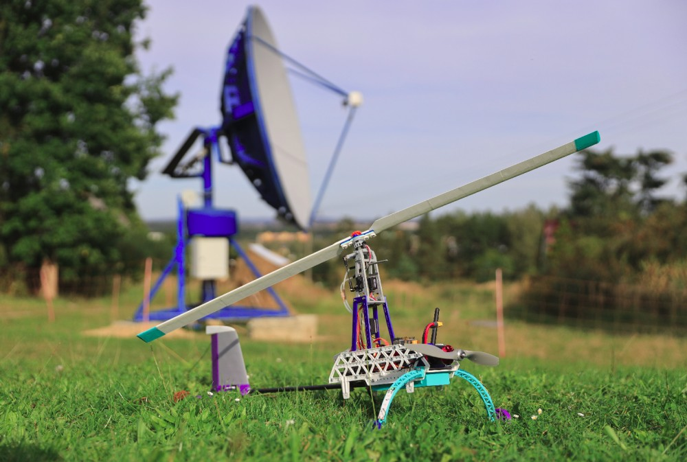

# TF-G2 training autogyro

Autogyro model for UAV pilot training and learning purposes.

  * High repairability and easy maintenance
  * Use of 3D printing flexibility
  * Predictable behavior in flight
  * Micro payload load capacity

